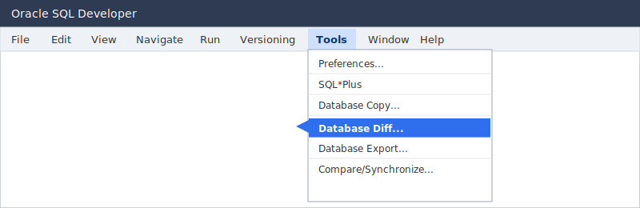
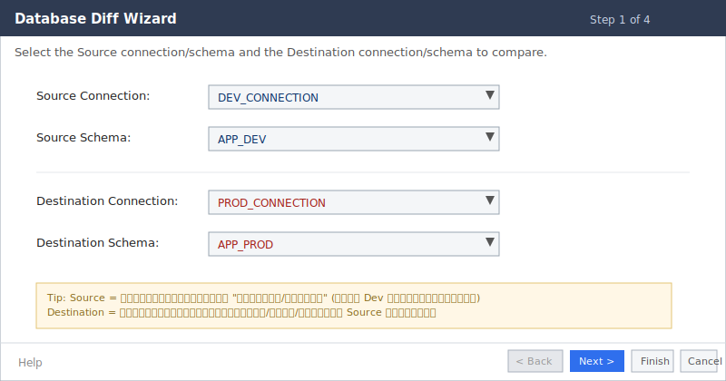
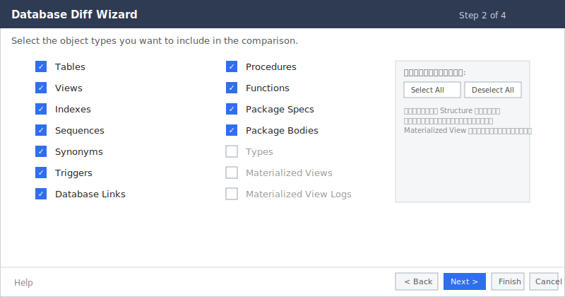
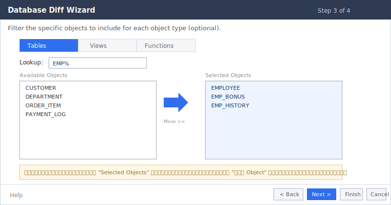
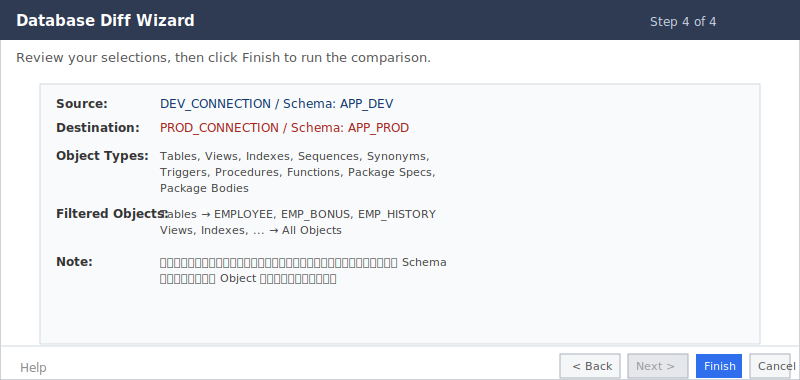
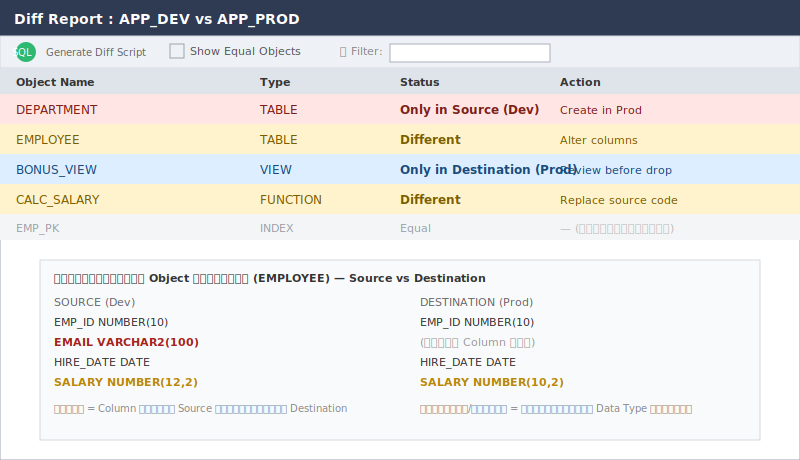

# คู่มือการใช้งาน Database Diff
## เปรียบเทียบ Structure ฐานข้อมูล Development กับ Production ด้วย Oracle SQL Developer (v21)

> **หมายเหตุเกี่ยวกับภาพประกอบ:** ภาพในคู่มือนี้เป็น **ภาพจำลอง (mock-up)** ที่วาดขึ้นเพื่ออธิบายตำแหน่งและหน้าที่ของแต่ละองค์ประกอบใน Wizard เท่านั้น หน้าจอจริงของ Oracle SQL Developer อาจมีสี/การจัดวางต่างไปเล็กน้อยตาม Theme และ Patch ที่ติดตั้ง แต่ชื่อฟิลด์ ลำดับขั้นตอน และตรรกะการทำงานจะตรงกับเวอร์ชัน 21.x

---

## สารบัญ

1. [ภาพรวมและวัตถุประสงค์](#1-ภาพรวมและวัตถุประสงค์)
2. [สิ่งที่ต้องเตรียมก่อนเริ่มงาน](#2-สิ่งที่ต้องเตรียมก่อนเริ่มงาน)
3. [การเปิดใช้งาน Database Diff Wizard](#3-การเปิดใช้งาน-database-diff-wizard)
4. [Step 1: Source and Destination Connections](#4-step-1-source-and-destination-connections)
5. [Step 2: Object Types to Compare](#5-step-2-object-types-to-compare)
6. [Step 3: Specify Objects](#6-step-3-specify-objects)
7. [Step 4: Summary](#7-step-4-summary)
8. [การอ่านผลลัพธ์ Diff Report](#8-การอ่านผลลัพธ์-diff-report)
9. [การดูรายละเอียดความแตกต่างระดับ Column/Source Code](#9-การดูรายละเอียดความแตกต่างระดับ-columnsource-code)
10. [การ Generate Sync Script (ALTER/CREATE)](#10-การ-generate-sync-script-altercreate)
11. [ข้อควรระวังเมื่อใช้งานกับ Production](#11-ข้อควรระวังเมื่อใช้งานกับ-production)
12. [ปัญหาที่พบบ่อยและวิธีแก้ไข](#12-ปัญหาที่พบบ่อยและวิธีแก้ไข)
13. [สรุปขั้นตอนแบบย่อ (Quick Reference)](#13-สรุปขั้นตอนแบบย่อ-quick-reference)

---

## 1. ภาพรวมและวัตถุประสงค์

**Database Diff** เป็นฟีเจอร์มาตรฐานที่มาพร้อมกับ Oracle SQL Developer (ไม่ต้องติดตั้งเพิ่ม ไม่มีค่าใช้จ่ายเพิ่มเติม) ใช้สำหรับเปรียบเทียบ **Structure ระดับ Object** ของ Schema สองฝั่ง เช่น Development กับ Production โดย**ไม่เปรียบเทียบข้อมูล (Data) ในตาราง** เปรียบเทียบเฉพาะ Definition/DDL เท่านั้น

วัตถุประสงค์หลักของการใช้งาน:

- ตรวจสอบว่า Object ใดถูกสร้างเพิ่มหรือถูกลบไปในแต่ละฝั่ง
- ตรวจสอบว่า Table/View ใดมี Column เปลี่ยนแปลง (เพิ่ม/ลด/เปลี่ยน Data Type/Nullable/Default)
- ตรวจสอบว่า Function/Procedure/Package มีการแก้ไข Source Code ที่ยังไม่ได้ Deploy ไปอีกฝั่ง
- สร้างสคริปต์สำหรับ Sync โครงสร้างให้ตรงกัน (ใช้เป็นจุดอ้างอิง ก่อนนำไป Review เอง)

---

## 2. สิ่งที่ต้องเตรียมก่อนเริ่มงาน

| รายการ | รายละเอียด |
|---|---|
| **Connection** | ต้องมี Database Connection ของทั้ง Dev และ Production ที่สร้างไว้ใน SQL Developer แล้ว (เห็นใน Connections Navigator ทางซ้าย) ถ้ามีแค่ Connection เดียว เมนู Database Diff จะถูก Disable |
| **สิทธิ์ผู้ใช้ (Privilege)** | แนะนำให้ขอ User แบบ **Read-only** ฝั่ง Production เพียงพอสำหรับการ Diff เช่น สิทธิ์ `SELECT` บน Data Dictionary หรือ Role `SELECT_CATALOG_ROLE` ถ้าต้องดู Object ของ Schema อื่นที่ไม่ใช่ Schema ของ User เอง ต้องมีสิทธิ์เพิ่มเติม (เช่น `SELECT ANY DICTIONARY`) |
| **Network/VPN** | เครื่องที่รัน SQL Developer ต้อง Connect ไปยัง Dev และ Production ได้พร้อมกันในเวลาเดียวกัน |
| **เวลาที่เหมาะสม** | หาก Schema มีขนาดใหญ่ การ Compare อาจใช้เวลาหลายนาที ควรเลือกเวลาที่ไม่กระทบช่วง Peak การใช้งานของระบบ Production |
| **Backup/Snapshot (ทางเลือก)** | หากต้องการ Generate Script ไปรันจริง ควรมี Backup หรือจุด Rollback ของ Production ก่อนเสมอ |

---

## 3. การเปิดใช้งาน Database Diff Wizard

จากเมนูหลักของโปรแกรม ไปที่ **Tools > Database Diff...**



**คำอธิบาย:**

- ถ้าไม่เห็นเมนู **Database Diff...** หรือเมนูเป็นสีจาง (Disable) ให้ตรวจสอบว่ามี Connection อย่างน้อย 2 รายการอยู่ใน Connections Navigator แล้ว
- บางเวอร์ชัน/บาง Build อาจมีเมนูนี้ซ้อนอยู่ใต้ **Database Copy** หรือเรียงลำดับต่างไปเล็กน้อย แต่ชื่อเมนูจะเป็น "Database Diff..." เสมอ

เมื่อคลิกแล้ว จะเปิดหน้าต่าง **Database Diff Wizard** ซึ่งมีทั้งหมด 4 ขั้นตอน (Step) ก่อนจะเริ่มเปรียบเทียบจริง

---

## 4. Step 1: Source and Destination Connections



**คำอธิบายแต่ละช่อง:**

| ช่อง (Field) | ความหมาย | คำแนะนำการเลือก |
|---|---|---|
| **Source Connection** | Connection ของฝั่งที่ใช้เป็น "ต้นแบบ" ในการเทียบ | เลือก Connection ของ **Development** เพราะปกติ Dev คือฝั่งที่มีการแก้ไขล่าสุด |
| **Source Schema** | ชื่อ Schema/User ฝั่ง Source ที่จะดึง Object มาเทียบ | ต้องเป็น Schema ที่เก็บ Object ของแอปพลิเคชันจริง (เช่น `APP_DEV`) ไม่ใช่ Schema ระบบ เช่น `SYS`/`SYSTEM` |
| **Destination Connection** | Connection ของฝั่งที่จะถูกตรวจสอบว่าต่างจาก Source อย่างไร | เลือก Connection ของ **Production** |
| **Destination Schema** | ชื่อ Schema/User ฝั่ง Destination | ควรเป็นชื่อ Schema ที่สอดคล้องกับ Source (เช่น `APP_PROD`) — ชื่อ Schema ทั้งสองฝั่งไม่จำเป็นต้องเหมือนกัน แต่ต้องเก็บ Object กลุ่มเดียวกัน |

> **ข้อสังเกต:** ปุ่ม **Next >** จะ Enable ก็ต่อเมื่อเลือกครบทั้ง 4 ช่องแล้ว และทั้งสอง Connection ต้องสามารถเชื่อมต่อได้จริง (Login สำเร็จ) ไม่เช่นนั้นระบบจะแจ้ง Error ก่อนไปขั้นตอนถัดไป

จากนั้นกดปุ่ม **Next >**

---

## 5. Step 2: Object Types to Compare



**ความหมายของแต่ละ Object Type ที่เลือกได้ (Checkbox):**

| Object Type | คือ Object อะไร | ทำไมควรเลือกในงานเทียบ Dev/Prod |
|---|---|---|
| **Tables** | ตารางข้อมูล รวมถึง Column, Data Type, Constraint, Default Value | สำคัญที่สุด เพราะการเปลี่ยน Structure ตารางมีผลกระทบต่อแอปพลิเคชันโดยตรง |
| **Views** | View ที่สร้างจาก Query | ใช้ตรวจว่า Logic การดึงข้อมูลของ View ทั้งสองฝั่งตรงกันหรือไม่ |
| **Indexes** | Index ของตาราง (Unique/Non-unique, Column ที่ใช้ Index) | ตรวจ Performance-related object ที่อาจถูกลืม Deploy |
| **Sequences** | ตัวให้เลขรันอัตโนมัติ (Auto-increment) | ตรวจค่า Start/Increment ที่อาจตั้งต่างกันโดยไม่ได้ตั้งใจ |
| **Synonyms** | ชื่อ Alias ที่ใช้อ้างอิง Object อื่น (อาจอยู่ Schema อื่น) | สำคัญถ้าระบบมีการเรียกข้าม Schema |
| **Triggers** | Code ที่รันอัตโนมัติเมื่อมีการ Insert/Update/Delete | ตรวจว่า Trigger Enable/Disable หรือ Logic ตรงกันหรือไม่ |
| **Database Links** | การเชื่อมต่อไปยังฐานข้อมูลอื่น | ตรวจว่ามี Link หลงเหลือหรือขาดไปหรือไม่ |
| **Procedures / Functions** | PL/SQL Code แบบ Standalone | ตรวจว่า Source Code Deploy ตรงกันหรือไม่ (เทียบทีละบรรทัด) |
| **Package Specs / Package Bodies** | Package (กลุ่มของ Procedure/Function) แยกเป็นส่วน Spec (Interface) และ Body (Logic จริง) | มักพบกรณี Deploy Body ไม่ครบ หรือ Spec ไม่ตรงกับ Body |
| **Types** | Object Type/Custom Data Type ที่ผู้ใช้สร้างขึ้น | เลือกถ้าระบบมีการใช้ Object-Relational Type |
| **Materialized Views / Materialized View Logs** | View ที่เก็บข้อมูลจริงและ Log การเปลี่ยนแปลงสำหรับ Refresh | เลือกเฉพาะถ้าระบบมีการใช้งานจริง เพราะมักมีขนาดใหญ่ทำให้ Compare ช้า |

> **คำแนะนำ:** ถ้าต้องการเทียบทุกอย่างครั้งแรกเพื่อสำรวจภาพรวม ให้ติ๊กทุกตัว (**Select All**) แต่ถ้าต้องการตรวจประเด็นเฉพาะเจาะจง (เช่น สงสัยว่า Function บางตัว Deploy ไม่ครบ) ให้ติ๊กเฉพาะ Object Type ที่เกี่ยวข้อง จะช่วยให้ผลลัพธ์อ่านง่ายขึ้นและ Compare เร็วขึ้น

กดปุ่ม **Next >**

---

## 6. Step 3: Specify Objects



**คำอธิบายแต่ละองค์ประกอบ:**

| องค์ประกอบ | หน้าที่ |
|---|---|
| **แท็บด้านบน (Tables / Views / Functions / ...)** | จะมี 1 แท็บต่อ Object Type ที่ติ๊กไว้ในขั้นตอนก่อนหน้า ใช้สลับไป Filter เฉพาะ Object ของแต่ละชนิด |
| **Lookup** | ช่องค้นหาแบบ Pattern โดยใช้ `%` แทนข้อความใดๆ เช่น พิมพ์ `EMP%` เพื่อกรองเฉพาะ Object ที่ชื่อขึ้นต้นด้วย EMP — มีประโยชน์มากเมื่อ Schema มี Object หลักร้อย/พัน |
| **Available Objects (ซ้าย)** | รายชื่อ Object ทั้งหมดของชนิดนั้นที่พบในฝั่ง Source ซึ่งยังไม่ถูกเลือก |
| **ปุ่มลูกศร (Move >> / Move <<)** | ใช้ย้าย Object จากซ้าย (Available) ไปขวา (Selected) หรือย้อนกลับ — ดับเบิลคลิกที่รายการก็สามารถย้ายได้เช่นกัน |
| **Selected Objects (ขวา)** | รายชื่อ Object ที่จะถูกนำไปเปรียบเทียบจริงในรอบนี้ |

> **กรณีพิเศษที่ควรรู้:** หาก**ไม่เลือกอะไรเลย**ใน Selected Objects ของ Object Type หนึ่งๆ ระบบจะตีความว่า "เทียบทุกตัว" ของชนิดนั้นโดยอัตโนมัติ ดังนั้นถ้าต้องการเทียบทั้ง Schema แบบครอบคลุม **สามารถข้าม Step นี้ได้เลยโดยไม่ต้องเลือกอะไร** แล้วกด Next ต่อได้ทันที — Step นี้มีไว้สำหรับกรณีที่ต้องการ "โฟกัสเฉพาะบาง Object" เท่านั้น

กดปุ่ม **Next >**

---

## 7. Step 4: Summary



**คำอธิบาย:**

หน้านี้เป็นเพียงหน้า**สรุปทบทวน**ก่อนรันจริง ไม่มีช่องให้กรอกเพิ่ม — ให้ตรวจทานว่า Source/Destination/Object Types/Filtered Objects ที่เลือกไว้ถูกต้องตามที่ต้องการหรือไม่ หากพบว่าผิด ให้กด **< Back** เพื่อย้อนกลับไปแก้ไขขั้นตอนก่อนหน้าได้

เมื่อตรวจสอบครบถ้วนแล้ว ให้กดปุ่ม **Finish** ระบบจะเริ่มกระบวนการเปรียบเทียบ (อาจใช้เวลาตั้งแต่ไม่กี่วินาทีถึงหลายนาที ขึ้นกับจำนวน Object และความเร็ว Network ไปยัง Production)

---

## 8. การอ่านผลลัพธ์ Diff Report

หลังจาก Compare เสร็จ จะเปิดหน้าต่าง **Diff Report** ขึ้นมาแสดงผลเป็นรายการ Object พร้อมสถานะ



**ความหมายของสี/สถานะในตาราง:**

| สี/สถานะ | ความหมาย | สิ่งที่ควรทำต่อ |
|---|---|---|
| 🔴 **Only in Source** | Object มีอยู่ใน Dev แต่**ไม่มีใน Production** | ต้อง Deploy/Create Object นี้ไปยัง Production (ถ้าเป็นของจริงที่ต้องใช้งาน) |
| 🔵 **Only in Destination** | Object มีอยู่ใน Production แต่**ไม่มีใน Dev** | ตรวจสอบก่อนว่าเป็น Object ที่ถูกสร้างเฉพาะ Production (เช่น Object ของทีม Infra) หรือเป็น Object เก่าที่ Dev ลบไปแล้วแต่ลืม Sync — **ห้าม Drop ทันทีโดยไม่ตรวจสอบ** |
| 🟡 **Different** | Object มีทั้งสองฝั่ง แต่ Definition ต่างกัน (Column, Data Type, Source Code ฯลฯ) | คลิกที่แถวนั้นเพื่อดู Detail เปรียบเทียบแบบ Side-by-side ในบานด้านล่าง |
| ⚪ **Equal** | Object เหมือนกันทั้งสองฝั่ง | ไม่ต้องทำอะไร (จะแสดงเฉพาะเมื่อติ๊ก **Show Equal Objects**) |

> **Show Equal Objects:** ปกติ Diff Report จะ**ซ่อน**รายการที่เหมือนกันทุกประการเพื่อให้ดูง่าย ถ้าต้องการเห็นรายการ Object ทั้งหมดแบบครบ (รวมที่เหมือนกัน) ให้ติ๊กช่องนี้

---

## 9. การดูรายละเอียดความแตกต่างระดับ Column/Source Code

เมื่อคลิกเลือกแถวที่มีสถานะ **Different** บานด้านล่างของหน้าต่าง Diff Report จะแสดงรายละเอียดแยกตามประเภท Object:

- **Table:** แสดงรายชื่อ Column ทั้งสองฝั่งแบบเทียบคู่กัน (Column Name, Data Type, Length, Nullable, Default) — Column ที่ขาดหรือ Data Type ต่างกันจะถูก Highlight สี
- **View:** แสดง Query Text ของ View ทั้งสองฝั่งแบบ Side-by-side เพื่อดูว่า Logic ต่างกันที่บรรทัดใด
- **Procedure/Function/Package:** แสดง Source Code (PL/SQL) ทั้งสองฝั่งแบบเทียบบรรทัดต่อบรรทัด คล้ายการทำ Diff โค้ดใน Git

ใช้ข้อมูลในส่วนนี้เพื่อตัดสินใจว่า "ความต่างที่เจอ" เป็นสิ่งที่ตั้งใจ (เช่น Production มี Tuning เพิ่มเติมเรื่อง Storage) หรือเป็นสิ่งที่ลืม Deploy จริงๆ

---

## 10. การ Generate Sync Script (ALTER/CREATE)

จากหน้า Diff Report คลิกไอคอน **SQL** สีเขียวที่มุมซ้ายบน (หรือคลิกขวาที่ Object ที่ต้องการ แล้วเลือก **Generate Diff Script**) ระบบจะ Generate DDL Script เป็น Script เดียวรวมทุก Object ที่เลือก

ตัวอย่างลักษณะ Script ที่จะได้ (เป็นเพียงตัวอย่างโครงสร้าง ไม่ใช่ Output จริงจากระบบ):

```sql
-- Generated by Database Diff: APP_DEV -> APP_PROD
-- Object: DEPARTMENT (TABLE) - Only in Source
CREATE TABLE APP_PROD.DEPARTMENT (
    DEPT_ID    NUMBER(10) NOT NULL,
    DEPT_NAME  VARCHAR2(100),
    CONSTRAINT DEPARTMENT_PK PRIMARY KEY (DEPT_ID)
);

-- Object: EMPLOYEE (TABLE) - Different
ALTER TABLE APP_PROD.EMPLOYEE ADD (EMAIL VARCHAR2(100));
ALTER TABLE APP_PROD.EMPLOYEE MODIFY (SALARY NUMBER(12,2));

-- Object: CALC_SALARY (FUNCTION) - Different
CREATE OR REPLACE FUNCTION APP_PROD.CALC_SALARY (...)
IS
BEGIN
    -- updated logic from Dev
    NULL;
END;
/
```

**สิ่งที่ต้องทำต่อหลัง Generate Script:**

1. คลิก **Save** เพื่อบันทึก Script เก็บไว้เป็นหลักฐาน (Audit Trail) ก่อนเสมอ
2. **ห้ามกด Run/Execute ทันทีบน Production** ให้เปิด Script นี้ใน SQL Worksheet แยก แล้ว Review ทุกบรรทัดก่อน
3. นำ Script ไปทดสอบรันบน **Test/UAT Environment** ก่อน เพื่อตรวจว่าไม่มี Error และไม่กระทบข้อมูลที่มีอยู่ (เช่น คำสั่ง `ALTER TABLE ... MODIFY` ที่ลด Length ของ Column อาจทำให้ข้อมูลเดิม Error ได้)
4. ตรวจสอบลำดับการรัน Statement (เช่น ต้องสร้าง Table ก่อนสร้าง Foreign Key ที่อ้างถึง Table นั้น)
5. เมื่อมั่นใจแล้ว จึงนำไปขอ Approve ตามขั้นตอน Change Management ของหน่วยงาน ก่อนรันบน Production จริง

---

## 11. ข้อควรระวังเมื่อใช้งานกับ Production

> ⚠️ ส่วนนี้สำคัญมากสำหรับการทำงานในหน่วยงานราชการ/องค์กรที่มีระบบ Production จริง

- **ใช้ User สิทธิ์อ่านอย่างเดียว (Read-only)** สำหรับ Connection ฝั่ง Production เสมอในขั้นตอน Diff — ไม่จำเป็นต้องให้สิทธิ์เขียนเพื่อแค่ "ดูความต่าง"
- **Database Diff ไม่ได้ Sync ข้อมูลอัตโนมัติ** มันสร้างได้แค่ Script DDL ให้ — การจะรันจริงหรือไม่ ผู้ใช้ต้องตัดสินใจและรับผิดชอบเอง
- คำสั่งบางประเภทที่ Generate มาอาจ**มีผลกระทบต่อข้อมูล** เช่น `DROP COLUMN`, `MODIFY` ที่ลด Size — ควร Backup หรือมี Point-in-time Recovery พร้อมก่อนรันจริงบน Production
- หลีกเลี่ยงการรัน Compare ที่ดึง Object จำนวนมากในช่วงเวลาที่ Production มีโหลดสูง เพราะการ Query Data Dictionary จำนวนมากอาจส่งผลต่อ Performance เล็กน้อย
- เก็บ Diff Report และ Sync Script ทุกครั้งไว้เป็นเอกสารประกอบการขอ Change (Change Request) เพื่อ Audit ย้อนหลังได้

---

## 12. ปัญหาที่พบบ่อยและวิธีแก้ไข

| ปัญหา | สาเหตุที่เป็นไปได้ | วิธีแก้ไข |
|---|---|---|
| เมนู **Database Diff** เป็นสีจาง กดไม่ได้ | มี Connection ใน Navigator น้อยกว่า 2 รายการ | สร้าง Connection เพิ่มให้ครบทั้ง Dev และ Prod |
| Compare แล้วค้างนาน/ไม่จบ | Schema มี Object จำนวนมาก หรือ Network ไปยัง Production ช้า/ไม่เสถียร | ลด Object Type ที่เลือก หรือใช้ Step 3 Filter เฉพาะ Object ที่สนใจ |
| ไม่เห็น Object บางตัว เช่น Object ของ Schema อื่น | User ที่ใช้ Connect ไม่มีสิทธิ์เห็น Object ของ Schema นั้น | ขอสิทธิ์ `SELECT ANY DICTIONARY` หรือ Role ที่เหมาะสมจาก DBA |
| Generate Script แล้ว Error ตอนรันจริง | ลำดับ Object ไม่ถูกต้อง (เช่น FK อ้างถึง Table ที่ยังไม่ถูกสร้าง) หรือ Object มี Dependency อื่น | จัดลำดับ Statement เองตาม Dependency หรือรันแยกเป็นกลุ่มทีละ Object Type |
| ผลลัพธ์ "Different" แต่ดูแล้ว Column เหมือนกันทุกอย่าง | อาจต่างกันที่ Storage/Tablespace Clause ซึ่งบางครั้งไม่เกี่ยวกับ Logic | ตรวจดู Detail ให้ละเอียด หากเป็นแค่ Storage Clause สามารถพิจารณาไม่ต้อง Sync ก็ได้ |

---

## 13. สรุปขั้นตอนแบบย่อ (Quick Reference)

1. เปิด **Tools > Database Diff...**
2. **Step 1:** เลือก Source Connection/Schema (Dev) และ Destination Connection/Schema (Prod)
3. **Step 2:** ติ๊กเลือก Object Type ที่ต้องการเทียบ (Tables, Views, Indexes, Functions, ...)
4. **Step 3:** (ถ้าต้องการ) Filter เฉพาะบาง Object ด้วย Lookup + ย้ายเข้า Selected Objects — ถ้าไม่เลือกจะถือว่าเทียบทุกตัว
5. **Step 4:** ตรวจทาน Summary แล้วกด **Finish**
6. อ่านผลลัพธ์ใน **Diff Report** — ดูสถานะ Only in Source / Only in Destination / Different / Equal
7. คลิกแถวที่ Different เพื่อดู Detail ระดับ Column/Source Code
8. คลิกไอคอน **SQL** เพื่อ **Generate Diff Script**
9. **Save Script → Review → ทดสอบบน Test/UAT → ขอ Approve → จึงนำไปรันบน Production**

---

*คู่มือนี้จัดทำขึ้นเพื่อใช้งานภายในหน่วยงาน อ้างอิงพฤติกรรมการทำงานของ Oracle SQL Developer ตระกูล 21.x — ชื่อเมนู/ตำแหน่งปุ่มอาจขยับเล็กน้อยตาม Patch แต่ลำดับขั้นตอนหลักยังคงเดิม*
